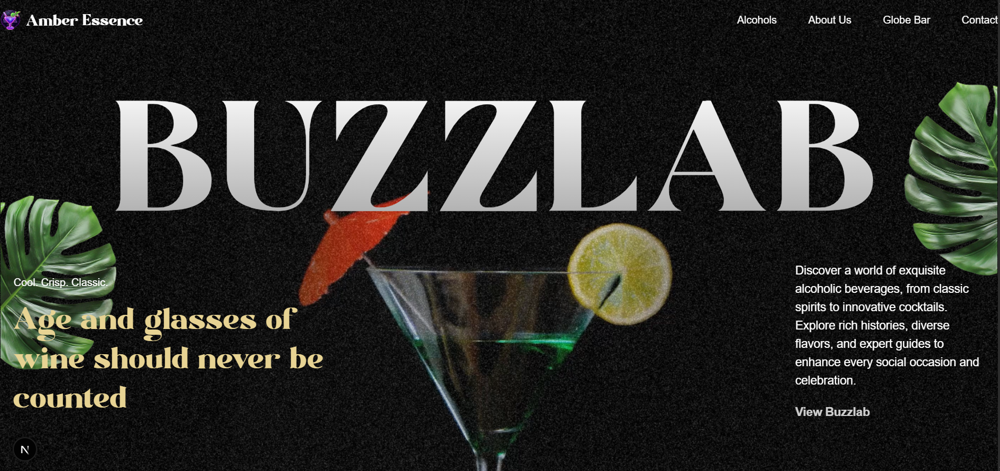
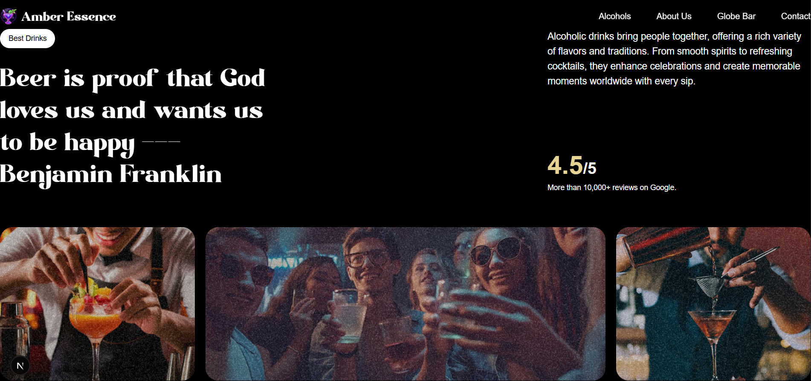
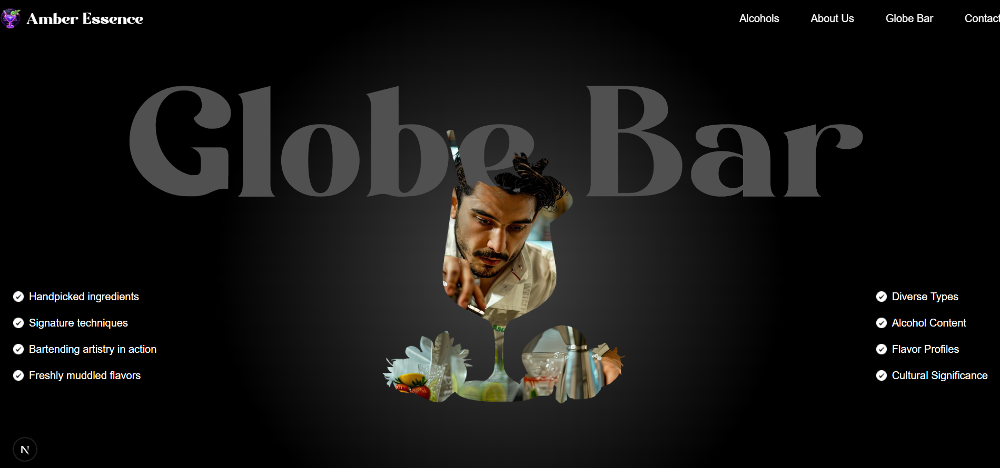
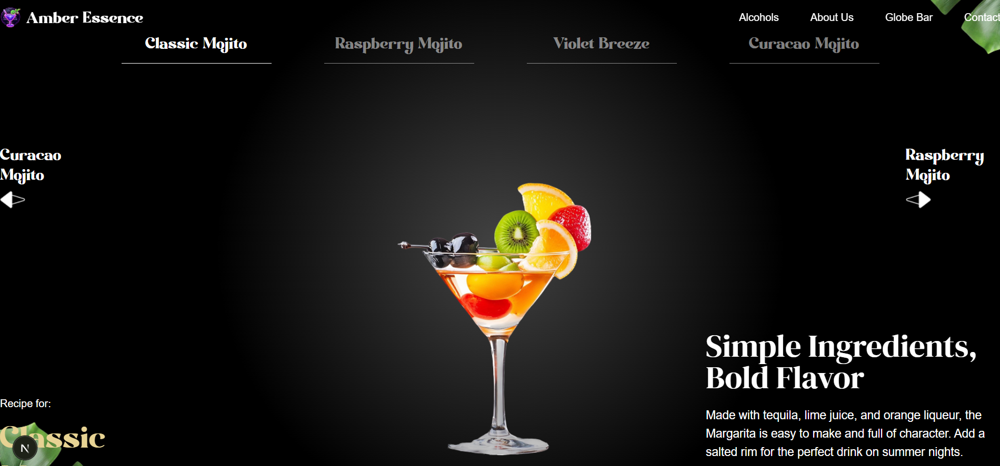

# Alcoholic Website 🍸  

I have created this website with the help of the YouTube channel **[JavaScript Mastery](https://www.youtube.com/c/JavaScriptMastery)**.  
The project focuses on showcasing alcoholic drinks and cocktails with a modern and interactive design.  

## ✨ Features  
- **Frontend Development:** Built using **Next.js** and **React**.  
- **Modern Animations:** Implemented using **GSAP** for smooth and engaging transitions.  
- **Rendering Fixes:** Solved compatibility issues between **Next.js server-side rendering** and **GSAP animations** by carefully managing component rendering.  

## 🛠️ Tech Stack  
- **Next.js**  
- **React**  
- **GSAP (GreenSock Animation Platform)**  
- **Tailwind CSS** (if used, mention here)  

## 🚀 Getting Started  
1. Clone the repository:  
   ```bash
   git clone https://github.com/Abhishek2788/buzzlab-world-of-drinks.git


## Getting Started

First, run the development server:

```bash
npm run dev
# or
yarn dev
# or
pnpm dev
# or
bun dev
```

# Libraries Used
npm install gsap @gsap/react react-responsive split-type

# Website UI






